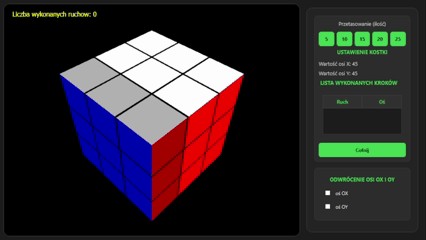
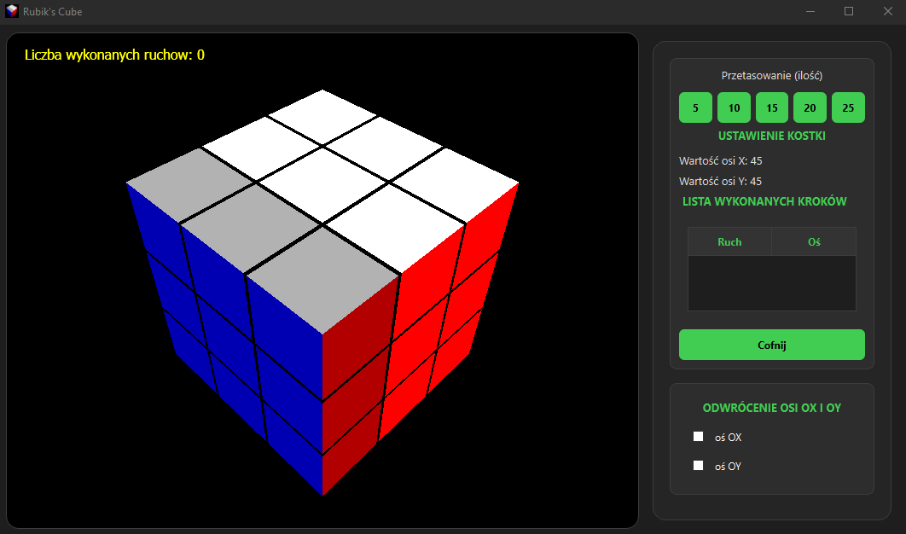

# Rubik's Challenge

A 3D interactive Rubik's Cube simulation built with C++, Qt, and OpenGL. This application focuses on realistic physics, smooth animations, and a modular architecture.

  

## About

Rubik's Challenge is a desktop application that renders a fully functional Rubik's Cube in real-time. It separates rendering logic from game state management, allowing for fluid controls and precise state tracking. Each cubie is an independent object, enabling row and column manipulations in 3D space.

## Key Features

* **Interactive 3D View**: Full control over camera rotation and zoom using mouse and keyboard inputs.
* **Smooth Animations**: Implemented "Smooth Rotation" logic for natural transition effects between states.
* **Move History**: A `StepTracker` system that records every move, allowing for history review and undo operations.
* **Shuffle Mechanism**: Automated randomization algorithm to generate a new puzzle state.
* **Modular Input Handling**: distinct handlers for Mouse, Keyboard, and Scroll events to ensure code clarity.

  

## Architecture

The project follows an event-driven architecture using Qt's Signal & Slot mechanism:

* **MainWindow**: Acts as the central container and UI manager.
* **OpenGLWidget**: Handles the OpenGL context, rendering loop, and 3D transformations.
* **Handlers**: Specialized classes (`MouseHandle`, `KeyboardHandle`, `ScrollHandle`) decouple input logic from the rendering engine.
* **Cube & TMove**: Manage the internal state and logic of the puzzle pieces.

## Requirements

* **C++ Standard**: C++17
* **Framework**: Qt 6 (compatible with Qt 5)
* **Build System**: CMake 3.16 or higher
* **Dependencies**: Qt Widgets, Qt Gui, Qt OpenGLWidgets, OpenGL Library

## Build Instructions

To build the project using CMake:

1.  Clone the repository.
2.  Create a build directory:
    `mkdir build && cd build`
3.  Configure the project:
    `cmake ..`
4.  Compile:
    `cmake --build .`

## Note
Disclaimer: This project is for educational purposes only.
